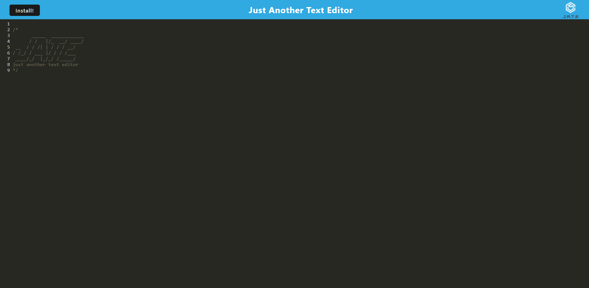

# Text Editor PWA
## Description
- This project's goal was to build a full stack text editor that runs in the browser.
- This app meets PWA criteria by being installable, and also features data persistence techniques with IndexedDB as the database. 
- The app is built to ensure that users can see whatever they type in the app even if they close out of the browser, are offline, or switch to the downloaded version of the app.
## Table of Contents
- [Installation](#installation)
- [Usage](#usage)
- [Credits](#credits)
- [License](#license)
- [Badges](#badges)
- [Tests](#tests)
## Installation
- No installation required just visit the deployed link.
## Usage
- Github Repo: https://github.com/jdomindev/text-editor-pwa
- Heroku Deployed Link: https://radiant-ocean-33909.herokuapp.com/
- Screenshots:
    
- Demo:
    
## Credits
- N/A
## License
MIT License

Copyright (c) 2022 Jose Dominguez

Permission is hereby granted, free of charge, to any person obtaining a copy of this software and associated documentation files (the "Software"), to deal in the Software without restriction, including without limitation the rights to use, copy, modify, merge, publish, distribute, sublicense, and/or sell copies of the Software, and to permit persons to whom the Software is furnished to do so, subject to the following conditions:

The above copyright notice and this permission notice shall be included in all copies or substantial portions of the Software.

THE SOFTWARE IS PROVIDED "AS IS", WITHOUT WARRANTY OF ANY KIND, EXPRESS OR IMPLIED, INCLUDING BUT NOT LIMITED TO THE WARRANTIES OF MERCHANTABILITY, FITNESS FOR A PARTICULAR PURPOSE AND NONINFRINGEMENT. IN NO EVENT SHALL THE AUTHORS OR COPYRIGHT HOLDERS BE LIABLE FOR ANY CLAIM, DAMAGES OR OTHER LIABILITY, WHETHER IN AN ACTION OF CONTRACT, TORT OR OTHERWISE, ARISING FROM, OUT OF OR IN CONNECTION WITH THE SOFTWARE OR THE USE OR OTHER DEALINGS IN THE SOFTWARE.
## Badges

## Tests
- N/A